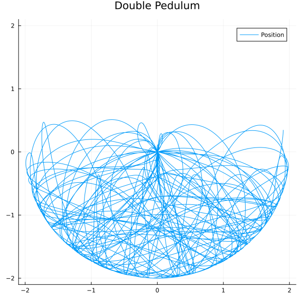
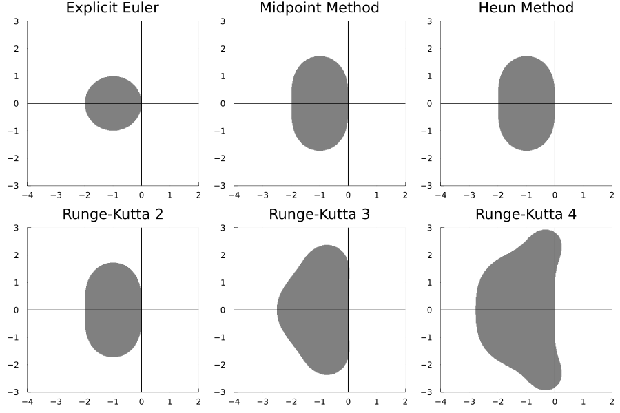

# Differential Equations

Numerical methods for solving differential equations implemented in the Julia programming language.

Currently the the code can handle explicit one step methods, including Explicit Runge-Kutta.

A method for generation Runge-Kutta based on the Butcher Tableau is implemented.

## Example problem

Application of a forth order Runge-Kutta to the Lorenz System:

$$ \frac{dx}{dt} = \delta (y- x) $$
$$ \frac{dy}{dt} = x (\rho - z) - y $$
$$ \frac{dz}{dt} = xy - \beta z $$

with parameters $\delta = 10$, $\rho = 28$ and $\beta = \frac{8}{3}$.

Solution of a double pendulum using a forth order Runge-Kutta:

## Stability Region

The program implemented has a feature to test if a method is stable for a givin region.
The stability region of some methods implemented is show below.

