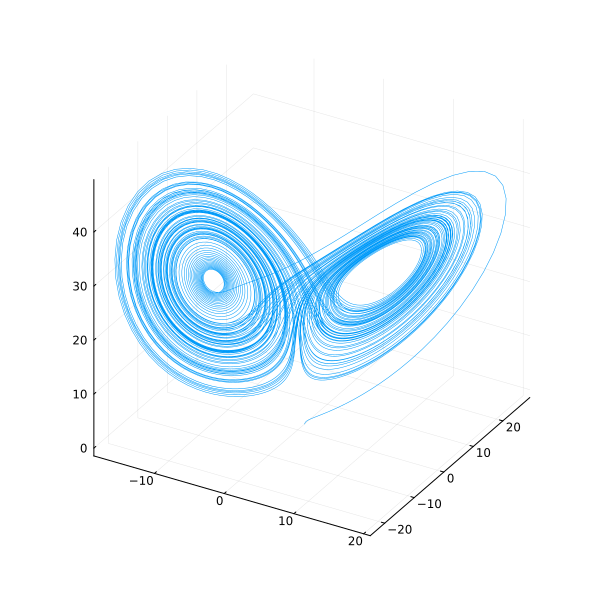

# Differential Equations

Numerical methods for solving differential equations implemented in the Julia programming language.

Currently the the code can handle explicit one step methods, including Explicit Runge-Kutta.

A method for generation Runge-Kutta based on the Butcher Tableau is implemented.

